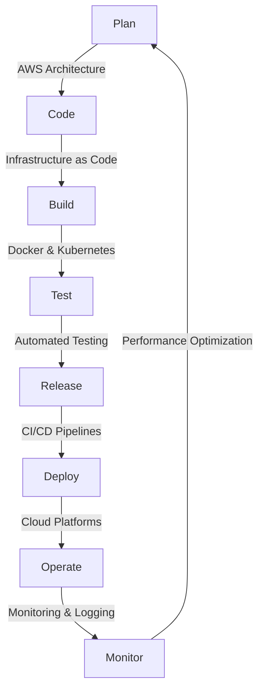

# 🚀 Jagan Mohan Yangala | DevOps Engineer

## 🛠 Skills in the Pipeline

### 📊 Plan & Design

### 💻 Code & Build

### 🐳 Containerize & Orchestrate

### 🔄 CI/CD

### 📈 Monitor & Optimize

## 🏆 Pipeline Achievements

- 🚀 Reduced deployment time by 40% through CI/CD pipeline optimization
- 🛡️ Implemented container security measures, reducing vulnerabilities by 75%
- 💰 Cut infrastructure costs by 30% via efficient cloud resource management
- 🏅 Received the SPOTLIGHT of THE MONTH Award for exceptional performance

## 📊 GitHub Stats

## 📫 Connect to My Pipeline

---

💡 Always iterating, always improving. Let's build robust, scalable systems together!
